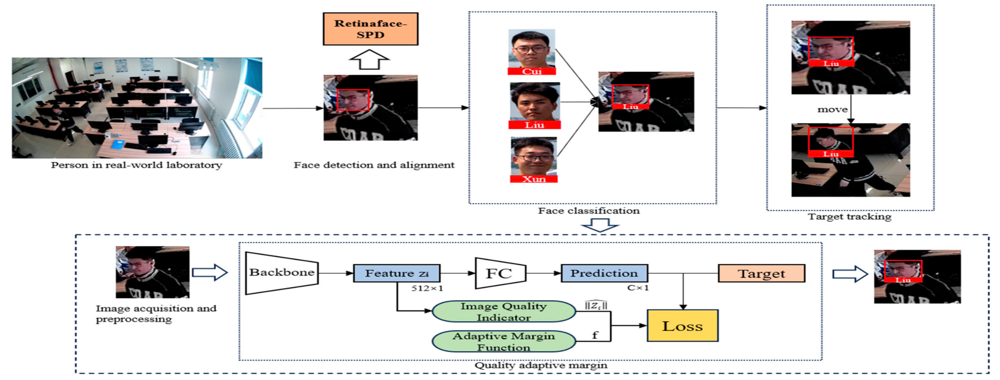
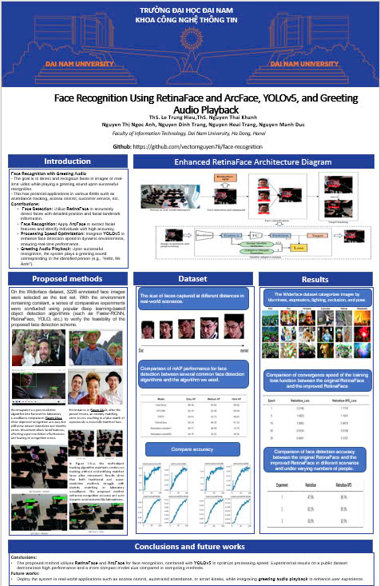

<h1 align="center">FACE RECOGNITION </h1>
<div align="center">

<p align="center">
  
  
</p>

[](https://www.facebook.com/DNUAIoTLab)
[](https://fitdnu.net/)
[](https://dainam.edu.vn)

</div>

## 🌟 Introduction  

- **Face Recognition**: Use **RetinaFace** for face detection and **ArcFace** for encoding and matching faces. After successful face recognition, the system will play the audio "Hello" to greet the user.  

- **Face Detection with YOLOv5**: Integrate **YOLOv5** for detecting faces in the frame with high accuracy and fast processing speed.  

- **Audio Playback**: Connect an audio module to automatically play the greeting "Hello" when a registered face is recognized.  

---
## ⚙ System
<p align="center">
  
</p>

---
### Create Environment and Install Packages

```shell
conda create -n face-dev python=3.9
```

```shell
conda activate face-dev
```

```shell
pip install torch==1.9.1+cpu torchvision==0.10.1+cpu torchaudio==0.9.1 -f https://download.pytorch.org/whl/torch_stable.html
pip install -r requirements.txt
```

### Add new persons to datasets

1. **Create a folder with the folder name being the name of the person**

   ```
   datasets/
   ├── backup
   ├── data
   ├── face_features
   └── new_persons
       ├── name-person1
       └── name-person2
   ```

2. **Add the person's photo in the folder**

   ```
   datasets/
   ├── backup
   ├── data
   ├── face_features
   └── new_persons
       ├── name-person1
       │   └── image1.jpg
       │   └── image2.jpg
       └── name-person2
           └── image1.jpg
           └── image2.jpg
   ```

3. **Run to add new persons**

   ```shell
   python add_persons.py
   ```

4. **Run to recognize**

   ```shell
   python recognize.py
   ```
## Technology

### Face Detection

1. **Retinaface**

   - Retinaface is a powerful face detection algorithm known for its accuracy and speed. It utilizes a single deep convolutional network to detect faces in an image with high precision.

2. **Yolov5-face**

   - Yolov5-face is based on the YOLO (You Only Look Once) architecture, specializing in face detection. It provides real-time face detection with a focus on efficiency and accuracy.

3. **SCRFD**
   - SCRFD (Single-Shot Scale-Aware Face Detector) is designed for real-time face detection across various scales. It is particularly effective in detecting faces at different resolutions within the same image.

### Face Recognition

1. **ArcFace**

   - ArcFace is a state-of-the-art face recognition algorithm that focuses on learning highly discriminative features for face verification and identification. It is known for its robustness to variations in lighting, pose, and facial expressions.

    <p align="center">
    
    <br>
    <em>ArcFace</em>
    </p>
## Reference
- [InsightFace - ArcFace](https://github.com/deepinsight/insightface/tree/master/recognition/arcface_torch)
- [face-recognition](https://github.com/vectornguyen76/face-recognition.git)
- [InsightFace-REST](https://github.com/SthPhoenix/InsightFace-REST)

## 📰 Poster

<p align="center">
  
</p>

---